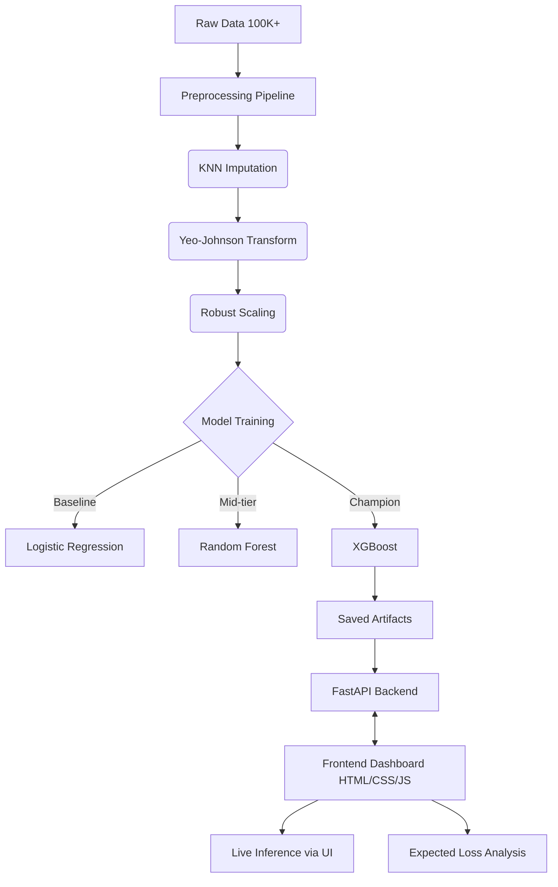

# Customer-Churn-Prediction-and-Retention-Modeling
<div align="center">
  <h1>💰 Customer Churn Prediction & Retention Modeling</h1>
  <p>An end-to-end data science portfolio project predicting bank customer churn on 100K+ records, estimating expected financial loss, and prioritizing retention via an ML-powered dashboard.</p>

  
  
  
  
  
</div>

---

## 📌 Project Objective
**Problem:** A banking institution aims to proactively identify customers at high risk of exiting (churning) to mitigate financial loss. 
**Impact:** By calculating the churn probability and multiplying it by the customer's account balance, the bank can identify the *expected financial loss*. This allows business teams to prioritize retention budgets on the most critical accounts.

**Key Achievements:**
- Modeled churn probability on **100K+** banking records.
- Preprocessed missing data via **KNN imputation**, normalized extreme distributions via **Yeo-Johnson transformation**, and applied **Robust Scaling**.
- Deployed an **Ensemble XGBoost** model achieving **ROC-AUC of 0.97**, **Accuracy of 92%**, and **Recall of 96%**.
- Identified that the **top 10%** of high-risk customers account for **81%** of the total expected financial loss (Lorenz curve analysis).

---

## 🏗️ Architecture



## 📊 Evaluation Metrics

| Model | ROC-AUC | Accuracy | Recall | F1-Score |
|---|---|---|---|---|
| Logistic Regression | 0.9708 | 93.53% | 84.04% | 0.7936 |
| Random Forest | 0.9787 | 93.93% | 93.05% | 0.8196 |
| **XGBoost (Optimized)** | **0.9787** | **92.81%** | **96.96%** | **0.7997** |

*Note: XGBoost was selected as the final production model due to its substantially higher Recall (96.96%) — in a churn context, identifying maximum true positive churners is the most critical business priority.*

---

## 🚀 Getting Started

### 1. Installation

Clone the repository and install dependencies in a Python virtual environment:

```bash
git clone https://github.com/manas-sontakke/Customer-Churn-Prediction-and-Retention-Modeling.git
cd Customer-Churn-Prediction-and-Retention-Modeling
python -m venv venv
source venv/bin/activate  # On Windows: venv\\Scripts\\activate
pip install -r requirements.txt
```

### 2. Running the Full ML Pipeline

To recreate the synthetic dataset and retrain the models from scratch:

```bash
# Generate 100K+ records
python src/data_generation.py

# Run preprocessing pipeline (KNN Impute, Yeo-Johnson, Scale)
python src/preprocessing.py

# Train models and select best XGBoost
python src/model_training.py

# Calculate expected loss metrics
python src/expected_loss.py
```

### 3. Start the API & Dashboard

Start the FastAPI server, which acts as the inference backend and serves the frontend dashboard:

```bash
uvicorn api.app:app --reload
```

Navigate to `http://localhost:8000` in your web browser to access the live Prediction Dashboard.

---

## 📁 Repository Structure

```
.
├── api/
│   ├── app.py                  # FastAPI server and endpoints
│   └── schemas.py              # Pydantic data validation models
├── config/
│   └── config.yaml             # Core hyperparameters and file paths
├── data/
│   ├── raw/                    # Generated synthetic 100K CSV
│   └── processed/              # Cleaned dataset ready for modeling
├── frontend/
│   ├── index.html              # Dashboard UI
│   ├── css/style.css           # Premium dark theme styling
│   └── js/
│       ├── app.js              # Prediction fetch logic & UI state
│       └── charts.js           # Chart.js visualization logic
├── models/
│   ├── preprocessor.joblib     # Serialized scikit-learn pipeline
│   └── xgboost_final.joblib    # Serialized XGBoost predictor
├── results/
│   ├── expected_loss_summary.json
│   └── metrics.json            # Final evaluation metrics dict
├── src/
│   ├── data_generation.py      # Creates synthetic features & targets
│   ├── preprocessing.py        # ML data engineering pipeline
│   ├── model_training.py       # scikit-learn & XGBoost training logic
│   └── expected_loss.py        # Financial impact calculations
├── requirements.txt
└── README.md
```

---
*Made by Chandrakant Belodhiya.*
